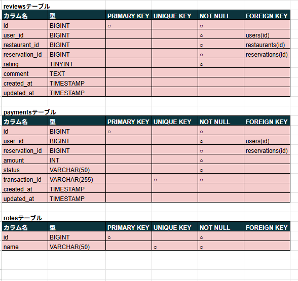

# Rese（飲食店予約アプリ）
---
## 環境構築
---
#### Dockerビルド
  1. git clone git@github.com:yumi0217/Rese-test.git
  2. cd Rese-test
  3. DockerDesktopアプリを立ち上げる
  4. docker-compose up -d --build
#### Laravel環境構築
  1. docker-compose exec php bash
  2. composer install
  3. .env の作成（開発／本番）
  - 開発環境：.env.example をコピーして .env を作成
  - 本番環境（ローカル“本番”運用想定）：下のテンプレ（.env.production の内容）を .env にコピー
  4. .envに以下の環境変数を追加
```
DB_CONNECTION=mysql
DB_HOST=mysql
DB_PORT=3306
DB_DATABASE=laravel_db
DB_USERNAME=laravel_user
DB_PASSWORD=laravel_pass
``` 
- 本番用の.env.productionを作成
```
APP_NAME=Laravel
APP_ENV=production
APP_KEY=base64:ewkFfErVglIQqtODhFcNGrs0iwgr712pej+DSEMJP24=
APP_DEBUG=true
APP_URL=http://localhost

LOG_CHANNEL=stack
LOG_DEPRECATIONS_CHANNEL=null
LOG_LEVEL=debug

DB_CONNECTION=mysql
DB_HOST=mysql
DB_PORT=3306
DB_DATABASE=laravel_db
DB_USERNAME=laravel_user
DB_PASSWORD=laravel_pass

BROADCAST_DRIVER=log
CACHE_DRIVER=file
FILESYSTEM_DRIVER=local
QUEUE_CONNECTION=sync
SESSION_DRIVER=file
SESSION_LIFETIME=120

MEMCACHED_HOST=127.0.0.1

REDIS_HOST=127.0.0.1
REDIS_PASSWORD=null
REDIS_PORT=6379

MAIL_MAILER=smtp
MAIL_HOST=mailhog
MAIL_PORT=1025
MAIL_USERNAME=null
MAIL_PASSWORD=null
MAIL_ENCRYPTION=null
MAIL_FROM_ADDRESS=test@example.com
MAIL_FROM_NAME="${APP_NAME}"


AWS_ACCESS_KEY_ID=
AWS_SECRET_ACCESS_KEY=
AWS_DEFAULT_REGION=us-east-1
AWS_BUCKET=
AWS_USE_PATH_STYLE_ENDPOINT=false

PUSHER_APP_ID=
PUSHER_APP_KEY=
PUSHER_APP_SECRET=
PUSHER_APP_CLUSTER=mt1

MIX_PUSHER_APP_KEY="${PUSHER_APP_KEY}"
MIX_PUSHER_APP_CLUSTER="${PUSHER_APP_CLUSTER}"

STRIPE_SECRET=
STRIPE_PUBLIC=
```
  5. アプリケーションキーの作成
```
php artisan key:generate
```
  6. マイグレーションの実行
```
php artisan migrate
```
  7. シーディングの実行
```
php artisan db:seed
```
  8. 公開ストレージへのシンボリックリンク作成
```
php artisan storage:link
```

## 環境切り替え手順（Local ⇄ Production）
このプロジェクトでは、開発用と本番用の2種類の環境設定ファイルを使い分けています。
下記の操作で簡単に切り替えることが可能です。

- 環境ファイル
| 用途   | ファイル名         | APP_ENV設定 | 備考 |
|--------|--------------------|--------------|------|
| 開発用 | `.env.local`       | `local`      | ローカル（Docker内での開発） |
| 本番用 | `.env.production`  | `production` | テスト／公開時（Cloudflare Tunnelなど） |
### 開発環境に切り替える場合
1. 現在の .env をバックアップ
```
cp -a .env .env.bak.$(date +%Y%m%d-%H%M%S)
```

2. 開発用設定に切り替え
```
cp -a .env.local .env
```

3. Laravelキャッシュをクリア
```
php artisan optimize:clear
```

### 本番環境に切り替える場合
1. 現在の .env をバックアップ
```
cp -a .env .env.bak.$(date +%Y%m%d-%H%M%S)
```
2. 本番用設定に切り替え
```
cp -a .env.production .env
```
3. Laravelキャッシュをクリア
```
php artisan optimize:clear
```
※変更後は必ず
php artisan optimize:clear を実行しないと
前の設定（APP_ENV や APP_URL など）が残ることがあります。

## ダミーデータの生成に使われるファイル
- `AreasTableSeeder.php`：エリア初期データ
- `GenresTableSeeder.php`：ジャンル初期データ
- `UsersTableSeeder.php`：一般ユーザー初期データ
- `AdminUserSeeder.php`：管理者ユーザー作成
- `RestaurantOwnerSeeder.php`：オーナーユーザー作成
- `RestaurantsTableSeeder.php`：店舗ダミーデータ
- `DatabaseSeeder.php`：まとめ呼び出し

### DatabaseSeeder.php 内容
```
public function run(): void
{
    $this->call([
        AreasTableSeeder::class,
        GenresTableSeeder::class,
        UsersTableSeeder::class,
        AdminUserSeeder::class,
        RestaurantOwnerSeeder::class,
        RestaurantsTableSeeder::class,
    ]);
}
```

## 認証機能
---
このプロジェクトの認証は **Laravelのセッションガード + カスタム実装** で構成されています（Fortify未使用）。

- 提供機能
---
- 会員登録（/register）
- ログイン（/login）
- ログアウト（POST /logout）

---

## テストログイン情報（ダミーユーザー）
---

| 役割   | メールアドレス        | パスワード     | 備考                     |
|--------|------------------------|----------------|--------------------------|
| 管理者 | admin@example.com      | password123    | `AdminUserSeeder` で作成 |
※一般ユーザーは、会員登録画面より各自でアカウントを作成してください。

## 使用技術(実行環境)
---
- PHP8.1.33
- Laravel8.83.29
- MySQL8.0.26
- Docker / Docker Compose（ローカル開発）
- phpMyAdmin（DB可視化）
- mailHog（開発中のメール確認ツール）
- PHPUnit（Feature/Unitテスト）
- FakerPHP（ダミーデータ生成）
- Laravel Seeder（初期データ投入）
- Stripe（決済・Webhook連携）※導入している場合
- Bladeテンプレートエンジン（ビュー構築）
- JavaScript（画像プレビュー機能、カスタムUI）
- CSS（デザインカスタマイズ）
- Eloquent ORM（モデルとDBの連携）

## メール確認
---
- mailHog: http://localhost:8025

## 予約リマインダーの自動実行設定（Laravel Scheduler）
---
このプロジェクトでは、当日の予約者に自動で**リマインダーメール**を送信する機能を備えています。  
自動実行のために、**Laravel Scheduler（スケジューラ）**を設定する必要があります。

### 設定手順
#### 1. 前提条件
- Docker コンテナ（`php`）が起動していること
```
command -v docker
```
- docker コマンドのパスが `/usr/bin/docker` であること（以下で確認）  
```
command -v docker
```
- `/usr/bin/docker` と表示されればOK
#### 2. ホスト側の cron に登録
ホスト環境で以下のコマンドを実行し、crontab を開きます。
```
crontab -e
```
開いたファイルの末尾に次の1行を追記します。
```
* * * * * cd /home/yumi/coachtech/laravel/Rese-test && /usr/bin/docker compose exec -T php php artisan reservations:send-reminders -q >> /dev/null 2>&1
```
> ※ `/home/yumi/coachtech/laravel/Rese-test` は環境に応じて変更してください。  
> ※ 毎分実行されます。10分おきにしたい場合は `*/10 * * * *` に変更可能です。

登録確認：
```
crontab -l
```
#### 3. メール送信設定
開発環境では、MailHog を使用してメール送信内容を確認できます。  

## メールリンクの挙動について
---
予約完了時に送信される **確認メール** には、  
「予約内容を確認する」リンクが含まれています。

このリンクを開く際は、**ログイン済みのユーザーのみアクセス可能** です。  
未ログイン状態でアクセスした場合は、自動的に **ログイン画面へリダイレクト** されます。

これは、**第三者によるURL直アクセスを防止するためのセキュリティ対策** です。  
リンク内の予約IDやトークンが外部に漏れても、本人以外は内容を確認できません。


## QRコード設計（ローカル／デモ運用について）
---
このプロジェクトは **ローカル＝開発兼“本番”運用** を前提としており、検証・操作性を優先するため、**ユーザー側にQRコードの中身（予約ID＋トークンまたは検証URL）を表示**しています。  
運用上の意図：店舗側の照合画面に **手入力・コピペ** でも対応できるようにするためです。

### 切り替えフラグ（例）
将来、挙動を環境変数で分ける場合の例です。


## テーブル設計
---




## 備考
※現時点では AWS 連携は未実装です（個人アカウントが有料プランのため）。
将来的には、S3 などのストレージ／デプロイ（EC2/RDS）対応を検討しています。

## ER図
---

## URL
---
  - 開発環境：http://localhost/
  - phpMyAdmin:：http://localhost:8080/

  